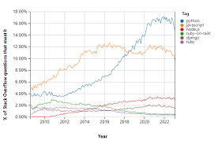
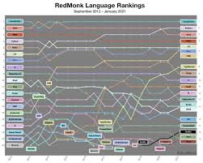
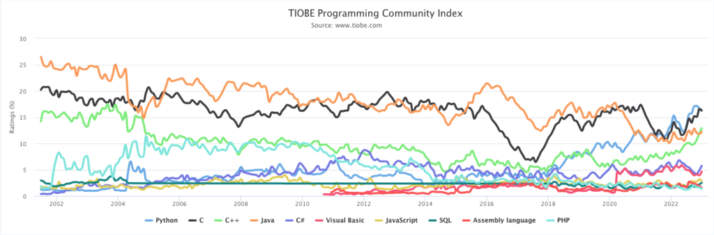

# 1.1 What is Python?

## Learning Objectives

By the end of this lesson, you should be able to:

- Define Python
- Describe the history of Python

## Introduction

Python is a high-level, interpreted, and general-purpose programming language. It is known for its simplicity and readability, which makes it an excellent choice for beginners. Python is also versatile and can be used for a wide range of applications, including web development, data analysis, artificial intelligence, and scientific computing.

Python is consistently ranked in the top 3 most popular programming language (according to rankings suchs as the TIOBE Index, the PYPL Popularity of Programming Language Index and others). It is widely used by companies such as Google, Facebook, Instagram, Spotify, and Netflix.

 

## History

Python was created by Guido van Rossum, a Dutch programmer, in the late 1980s. The language was named after the British comedy group Monty Python, not the snake. Python was designed to be easy to read and write, with a clean and simple syntax.

The first version of Python, Python 0.9.0, was released in 1991. Since then, Python has evolved into a powerful and popular programming language.

## Exercise

1. Who created Python?
   Ans: Guido van Rossum
2. When was the first version of Python released?
   Ans: 1991
3. Which type of programming language is Python?
   - A. Interpreted
   - B. Compiled
     Ans: A
