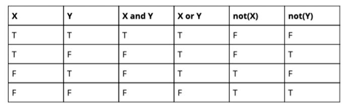

# 2.4 Operators and Boolean Expressions

## Learning Objectives

By the end of this lesson, you should be able to:

- Use arithmetic operators for calculations
- Update variables using assignment operators
- Define boolean expressions in Python
- Use comparison operators to create boolean expressions
- Use logical operators to combine boolean expressions
- Understand the truthiness and falsiness of values
- Understand operators precedence

## Arithmetic Operators

Arithmetic operators are used to perform mathematical operations in Python. The most common arithmetic operators are:

- **Addition (`+`):** Adds two values.
- **Subtraction (`-`):** Subtracts the second value from the first.
- **Multiplication (`*`):** Multiplies two values.
- **Division (`/`):** Divides the first value by the second.
- **Modulus (`%`):** Returns the remainder of the division.
- **Exponentiation (`**`):\*\* Raises the first value to the power of the second.
- **Floor Division (`//`):** Returns the integer part of the division.

Here are some examples of using arithmetic operators:

```python
x = 10
y = 3

print(x + y)  # 13
print(x - y)  # 7
print(x * y)  # 30
print(x / y)  # 3.3333333333333335
print(x % y)  # 1
print(x ** y)  # 1000
print(x // y)  # 3
```

## Assignment Operators

Assignment operators are used to update the value of a variable. The most common assignment operators are:

- **Assignment (`=`):** Assigns a value to a variable.
- **Addition Assignment (`+=`):** Adds a value to the variable and assigns the result.
- **Subtraction Assignment (`-=`):** Subtracts a value from the variable and assigns the result.
- **Multiplication Assignment (`*=`):** Multiplies the variable by a value and assigns the result.
- **Division Assignment (`/=`):** Divides the variable by a value and assigns the result.

Here are some examples of using assignment operators:

```python
x = 10

x += 5  # Equivalent to x = x + 5
print(x)  # 15

x -= 3  # Equivalent to x = x - 3
print(x)  # 12

x *= 2  # Equivalent to x = x * 2
print(x)  # 24

x /= 4  # Equivalent to x = x / 4
print(x)  # 6.0
```

## Boolean Expressions

Boolean expressions are expressions that evaluate to either `True` or `False`. In Python, boolean expressions are created using comparison operators and logical operators.

### Comparison Operators

Comparison operators are used to compare two values. The most common comparison operators are:

- **Equal to (`==`):** Returns `True` if the values are equal.
- **Not equal to (`!=`):** Returns `True` if the values are not equal.
- **Greater than (`>`):** Returns `True` if the first value is greater than the second.
- **Less than (`<`):** Returns `True` if the first value is less than the second.
- **Greater than or equal to (`>=`):** Returns `True` if the first value is greater than or equal to the second.
- **Less than or equal to (`<=`):** Returns `True` if the first value is less than or equal to the second.
- **Identity (`is`):** Returns `True` if the variables are the same object.

Here are some examples of using comparison operators:

```python
x = 5
y = 10

print(x == y)  # False
print(x != y)  # True
print(x > y)  # False
print(x < y)  # True
print(x >= y)  # False
print(x <= y)  # True
```

### Logical Operators

Logical operators are used to combine boolean expressions. The most common logical operators are:

- **AND (`and`):** Returns `True` if both expressions are `True`.
- **OR (`or`):** Returns `True` if at least one expression is `True`.
- **NOT (`not`):** Returns `True` if the expression is `False`.



Here are some examples of using logical operators:

```python
x = 5
y = 10

print(x > 3 and y > 5)  # True
print(x > 3 and y < 5)  # False
print(x > 3 or y < 5)  # True
print(not x > 0)  # False
```

### Truthiness and Falsiness

In Python, values have a truthiness or falsiness associated with them. The following values are considered `False`:

- `False`
- `None`
- `0` (integer)
- `0.0` (float)
- `""` (empty string)
- `[]` (empty list)
- `{}` (empty dictionary)
- `()` (empty tuple)
- `set()` (empty set)

All other values are considered `True`.

### Operator Precedence

Operator precedence determines the order in which operators are evaluated in an expression. Operators with higher precedence are evaluated first. Here is the precedence order from highest to lowest:

1. Parentheses `()`
2. Exponentiation `**`
3. Multiplication `*`, Division `/`, Modulus `%`, Floor Division `//`
4. Addition `+`, Subtraction `-`
5. Comparison Operators `==`, `!=`, `>`, `<`, `>=`, `<=`, `is`
6. Logical Operators `not`, `and`, `or`
7. Assignment Operators `=`, `+=`, `-=`, `*=`, `/=`

You can use parentheses to change the order of evaluation in an expression. For example:

```python
x = 5
y = 10
z = 15

result = x + y * z
print(result)  # 155

result = (x + y) * z
print(result)  # 225
```

## Exercise

1. What is the result of the following expressions?
   - `5 + 3 * 2`
   - `(5 + 3) * 2`
   - `10 / 2 + 5`
   - `10 / (2 + 5)`
   - `5 > 3 and 10 < 5`
   - `5 > 3 or 10 < 5`
   - `not 5 > 3`
2. What is the truthiness or falsiness of the following values?
   - `True`
   - `False`
   - `None`
   - `0`
   - `0.0`
   - `""`
   - `[]`
   - `{}`
   - `()`
   - `set()`
   - `"Hello, World!"`
3. What is the result of the following expressions?
   - `5 + 3 * 2 == 11`
   - `5 + 3 * 2 != 11`
   - `5 + 3 * 2 > 11`
   - `5 + 3 * 2 < 11`
   - `5 + 3 * 2 >= 11`
   - `5 + 3 * 2 <= 11`
4. What is the result of the following expressions?
   - `5 > 3 and 10 < 5`
   - `5 > 3 or 10 < 5`
   - `not 5 > 3`
